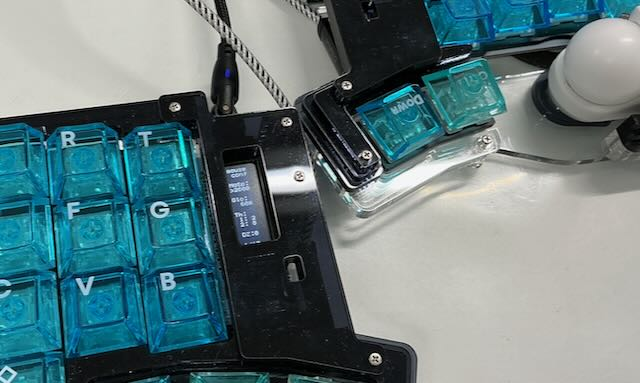
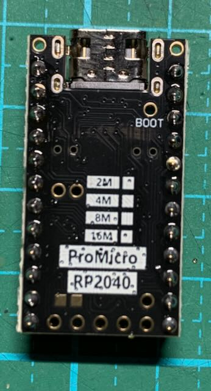

# Keyball（本ファーム概要）

## 概要
このリポジトリは Keyball シリーズ用ファームウェア（QMK+vialベース）です。 
[keyball公式](https://github.com/Yowkees/keyball "Yowkees/keyball")を元に、RP2040系として個人的に作成したものです。 
トラブル等は公式には問い合わせず、こちらのリポジトリのissueへお願いします。 
機能としては、vial対応、スワイプ（マウスジェスチャ）、擬似フリック入力、OLEDでの挙動調整などを追加しています。 

## 対応ボード（RP2040系）
- RP2040 へ載せ替えが必要です。ATmega32U4系promicro(普通のkeyballで使用しているボード)のままでは使用できません）
- 必要ボード: 下記いずれか
  - AliExpressの本品: https://ja.aliexpress.com/item/1005005980167753.html?channel=twinner
  - RP2040 ProMicro 互換（4MBで可）

## 対応手順
- 対応のボードのシルク（端子の記載）をよく確認の元、お手持ちのkeyballの仕様に合うようにコンスルーかピンヘッダを使用して取り付けてください。
- 確認しているボードでは、リセットスイッチが下側（取り付けると隠れてしまう側）に来るように取り付けることになります。
- 取り付ける前に、RP2040へファームを書き込んでください。取り付けた後は、keyballのリセットスイッチ（タクトスイッチ）を素早く2回押すことで、PCに書き込み可能モード（BOOTSEL）が現れます。
- またはQK_BOOTを使用しても良いです。
- 画像の面が上を向くようにしてください。

## !!ファームの使用の前に!!
### karabiner-elementsの導入の推奨（macユーザ向け）
- このファームをmacで使用する場合、karabiner-elementsを使用して、right-controlをFnに変更することを強く推奨します。
- vialでRALT(KC_C)などを割り当てた場合、macではLGUI(KC_C)、その他ではLCTL(KC_C)として動作するようになっています。
- また、ビルドできる方はキーマップにF1などを割り当てることで、macではRALT(KC_F1)->Fn(KC_F1)として動作するようになります。その他のOSではKC_F1として動作します。
### mac mouse fixの導入の推奨（macユーザ向け）
- mac mouse fixも導入することを推奨します。

## このファームで利用できる主な機能
### Vial 対応（キーマップの動的編集が可能）
- vial web app(https://vial.rocks/)かデスクトップアプリをご利用ください(https://get.vial.today/manual/)

### スワイプ（マウスジェスチャ）操作の対応
- SW_系のキーを押しながら、上下左右にスワイプすることで、アプリ切替や音量調整などが可能。
- swipe_user.cの実装を変更することで、機能を追加できます。

| キーコード | 説明                       |タップ                                |左             |下                          |上                       |右            |
|:-----------|:---------------------------|:-------------------------------------|:--------------|:---------------------------|:------------------------|:-------------|
| `APP_SW`   | アプリ切替スワイプ         |タスクビュー ミッションコントロール| 右デスクトップ|タスクビュー アプリビュー|copilot スポットライト|左デスクトップ|
| `VOL_SW`   | 音量/メディア操作スワイプ  |再生/停止                             |前の曲         |音量上昇                    |音量減少                 |次の曲        |
| `BRO_SW`   | ブラウザ/履歴スワイプ      |アドレスバー                          |戻る           |ペースト                    |コピー                   |進む          |
| `TAB_SW`   | タブ切替スワイプ           | 新規タブ                             |前のタブ       |タブを閉じる                |最後に閉じたタブ         |次のタブ      |
| `WIN_SW`   | ウィンドウ位置操作         |ウィンドウを最大化                    |左半分に       |下半分に                    |上半分に                 |右半分に      |
| `SW_ARR`   | 矢印キー                   |動作なし                              |左キー         |下キー                      |上キー                   |右キー        |
| `SW_EX1`   | 各自拡張用                 |F13                                   |F15            |F16                         |F14                      |F17           |
| `SW_EX2`   | 各自拡張用                 |F17                                   |F21            |F20                         |F18                      |F19           |

### 擬似フリック入力
- Flick_系のキーを押しながら、上下左右にスワイプまたはMULTI_{A, B, C}を押下することで、方向に応じた文字入力が可能。
- MULTI_Aは左、Bは右、Cの単体タップは上、Cのダブルタップは下に対応しています。

| キーコード | 説明           |タップ  |左        |下          |上        |右        |
|:-----------|:---------------|:-------|:---------|:-----------|:---------|:---------|
| `FLICK_A`  | 擬似フリックA  |a       |b         |なし        |なし      |c         |
| `FLICK_D`  | 擬似フリックD  |d       |e         |なし        |なし      |f         |
| `FLICK_G`  | 擬似フリックG  |g       |h         |なし        |なし      |c         |
| `FLICK_J`  | 擬似フリックJ  |j       |k         |なし        |なし      |c         |
| `FLICK_M`  | 擬似フリックM  |m       |l         |なし        |なし      |c         |
| `FLICK_P`  | 擬似フリックP  |p       |q         |なし        |r         |s         |
| `FLICK_T`  | 擬似フリックt  |t       |u         |なし        |なし      |v         |
| `FLICK_W`  | 擬似フリックw  |w       |x         |なし        |y         |z         |

### マルチキー入力
- どのスワイプキーを押しているかによって押した際の機能が変わります。
- multi_user.cの実装を変更することで、機能を追加できます。

| キーコード | 説明           |スワイプタグなし  |スワイプタグあり                            |
|:-----------|:---------------|:-----------------|:-------------------------------------------|
| `MULTI_A`  | マルチキーA　  |undo              |左スワイプ                                  |
| `MULTI_B`  | マルチキーB　  |redo              |右スワイプ                                  |
| `MULTI_C`  | マルチキーC　  |動作なし          |上スワイプ ダブルタップで下スワイプ      |
| `MULTI_D`  | マルチキーD　  |動作なし          |動作なし                                    |

### 設定用カスタムキー
| キーコード  | 説明                    |
|:------------|:------------------------|
| `KBC_RST`   | 設定リセット            |
| `KBC_SAVE`  | 設定保存                |
| `STG_TOG`   | OLEDの設定画面を開く    |
| `SSNP_VRT`  | 垂直スクロールスナップ  |
| `SSNP_HOR`  | 水平スクロールスナップ  |
| `SSNP_FRE`  | スクロールスナップフリー|
| `SCSP_DEC`  | スクロール速度減少      |
| `SCSP_INC`  | スクロール速度増加      |
| `MOSP_DEC`  | マウスポインタ速度減少  |
| `MOSP_INC`  | マウスポインタ速度増加  |

### OLED表示
- lib_user/user/user/oled_user.cで表示内容を変更できます。

| 関数                              | 説明                                                        |
|:----------------------------------|:------------------------------------------------------------|
|oled_render_info_layer_default()   |  現在のデフォルトレイヤー                                   |
|oled_render_info_ball()            |  トラックボールの現在値                                     |
|oled_render_info_keycode()         |  送信キーコード                                             |
|oled_render_info_mods()            |  modifier keyの状態 順番にShift, Ctrl, Gui, alt             |
|oled_render_info_mods_oneshot()    |  one shot modifier keyの状態 順番にShift, Ctrl, Gui, alt    |
|oled_render_info_mods_lock()       |  modifier keyのlock状態 順番にShift, Ctrl, Gui, alt, Caps   |
|oled_render_info_cpi()             |  ポインターの速度                                           |
|oled_render_info_scroll_step()     |  スクロール速度                                             |
|oled_render_info_swipe_tag()       |  スワイプ状態                                               |
|oled_render_info_key_pos()         |  押したキーの位置                                           |

### OLED 上での設定
- SET_TOGキーを押すと、OLEDが設定モードに切り替わります。（再度押すと通常画面に戻ります。）
- 上下でカーソルの移動。左右でページ移動。Shift+左右で値の増減が可能です。
- 設定はKBC_SAVEキーで保存されます。KBC_RSTキーで初期化されます。
- ご自分でビルドされる方は、lib/keyball/keyball.hで設定されているマクロをkeyball/.../keymap/user/config.hで上書きすることで、初期値を変更できます。

### mouse config
- MoSp: (Mouse speed)ポインタの速度
- Glo: (Gain low speed)低速域のゲイン。低速域ではポインタの速度がここで指定した割合になります。
- Th1/Th2: (Threshold1 / 2)低速域のしきい値。Th1以下ではGlo、Th1～Th2では線形補間されたゲイン、Th2以上ではMoSpの速度になります。
- DZ: (DEAD ZONE)この値以下のボールの動作は無視されます。

### AML config
- en: (enable) AUTO MOUSE LAYERの有効/無効
- TO: AUTO MOUSE LAYERのタイムアウト時間(ms)。500ms単位で増減。9500より大きく設定しようとすると、HOLDとして60秒間の設定となります。
- AMLはマウスキー以外のボタンを押すことで解除されます。（マウスキー：MS_BTN1やスワイプキー。util_user.cで追加設定できます。）
- TH: AUTO MOUSE LAYERの閾値。これを超えるとAMLが有効になります。
- TG_L: (Target Layer)AMLが有効になったときに切り替わるレイヤー。

### Scroll config
- Sp: (Scroll Speed)スクロールのステップ。1～7で設定可能。
- Dz: (DEAD ZONE)この値以下のボールの動作は無視されます。
- Inv: (Invert)スクロールの反転。
- ScLy: (Scroll Layer)任意のレイヤーでスクロールモードをを有効にする。
- LNo: (Layer number)スクロールモードを有効にするレイヤー番号。
- Mode: (Preset Mode)プリセットモード。m:macモード。f:高精度モード。n:標準モード。macでは高精度モードを使用できません。
- H_Ga: (Horizontal Gain)スクロール最終ゲインの水平成分。垂直成分に対する割合(%)。左右方向のスクロールを遅くしたい場合に調整します。

### SSNP config
- Mode: ver/ hor/ free。一方向へのスクロールを優先し、一定以上の量を超えた場合にフリースクロールになります。freeは常にフリースクロールです。
- Thr:  (Threshold) ver/horモードでフリースクロールに切り替わる閾値。
- Rst: フリースクロールでいる時間。

### Swipe config
- St: (Swipe Threshold) スワイプと判定する閾値
- Dz: (Dead Zone) この値以下のボールの動作は無視されます。
- Rt: (Reset Time) スワイプ動作のリセット時間(ms)。この時間内に閾値を超える動作がなければ、スワイプ動作はリセットされます。
- Frz: (Freeze) スワイプ中にポインタを固定するかどうか。

### RGB config
- light on/off
- HUE (色相)。
- SAT (彩度)。
- VAL (明度)。
- Mode アニメーションモード。

### layer config
- def: (Default Layer) デフォルトレイヤーとするレイヤー番号。

## 詳細ドキュメント
- APIや詳細仕様は `keyball/lib/keyball/README.md` を参照。

## セットアップとビルド
- シェルスクリプトによる導入（MSYS2/macOS/Ubuntu想定）
  - `bash scripts/setup_and_build.sh`
  - 依存確認→qmk CLI venv→シンボリックリンク作成→QMK & Vial ビルドまで自動実行
- GitHub Actions でのビルド
  - Actions → "Keyball manual build (QMK/Vial)"
  - 入力フォームで kb（例: keyball/keyball61）, km（例: mymap）, impl（qmk/vial）を選択
- Vial 上でキーマップの編集が可能です（Vial対応ビルドを使用）。

## ビルド済み生成物
- `build/` ディレクトリにビルド済みファームが入っています（必要に応じて更新）。

## 問い合わせ
- 公式ではなく、こちらへお願いします: https://x.com/toxa_craft
- issueでも可能。
